# Batch Build & Verification Instructions — 2-Part ProMini EEprom Logger

Step-by-step build, test, and calibration guide for assembling these loggers **in batches**.
Based on the [Cave Pearl Project 2022 tutorial](https://thecavepearlproject.org/2022/03/09/powering-a-promini-logger-for-one-year-on-a-coin-cell/)
and its [build video](https://www.youtube.com/watch?v=58ps9fUyY0Q). This document adds a
staged verification workflow: every stage ends with a **VERIFY** box, most backed by a
numbered test sketch in the [`tests/`](tests/) folder.

> **Batch workflow:** label every unit first (U01, U02, …), then complete each stage across
> **all** units before starting the next stage. Print one [CHECKLIST.md](CHECKLIST.md) per
> unit and fill it in as you go — the recorded values (sleep current, calibration constant)
> are per-chip and cannot be reconstructed later. Expect ~10–20% of cheap modules to fail
> QC ("infant mortality"); buy spares and test everything before assembly.

Steps tagged **[OPTIONAL]** can be skipped without breaking the core logger.
Everything else is required for coin-cell operation.

 

*Left: the finished 2-module stack. Right: the full schematic — keep it open while soldering.
Step photos throughout this guide are local copies (in [images/steps/](images/steps/)) of
photographs from the [Cave Pearl Project tutorial](https://thecavepearlproject.org/2022/03/09/powering-a-promini-logger-for-one-year-on-a-coin-cell/)
(© Edward Mallon), so the whole guide works offline at the bench.*

---

## Build configuration used in this guide

Two `#define` profiles for the main sketch keep the **powers-of-2 rule** satisfied
(explained in [Appendix A](#appendix-a--the-powers-of-2-rule)). Pick one per unit and record
it on the [checklist](CHECKLIST.md):

**BURN-IN profile** — bare logger soak test, no external sensors (8 bytes/record):

```cpp
#define logLowestBattery_1byte
#define logRTC_Temperature_1byte
#define logCurrentBattery_2byte          // padding to reach 8 bytes
#define readD7resistorwD6ref_2byte       // NTC thermistor
#define readD9resistorwD6ref_2byte       // LDR
#define LED_GndGB_A0_A2
```

**DEPLOY profile** — BMP280 (temperature only) + BH1750 attached, logging to the external
64k AT24C512 EEprom ([Appendix B](#appendix-b--add-an-external-i2c-eeprom-for-more-storage))
(8 bytes/record):

```cpp
#define logLowestBattery_1byte
#define logRTC_Temperature_1byte
#define readD7resistorwD6ref_2byte       // NTC thermistor
#define readBh1750_LUX_2byte             // BH1750 light sensor
#define recordBMEtemp_2byteInt           // BMP280 temp via forcedBMX280 library
#define LED_GndGB_A0_A2
// storage -> external 64k EEprom on the I2C bus. These appear in TWO places
// (the STEP0 block ~line 108 AND the duplicate ~line 146) - both must agree:
#define EEpromI2Caddr 0x50
#define totalBytesOfStorage 65536        // AT24C512 (64k)
// readD9resistorwD6ref_2byte stays commented out: the LDR remains soldered
// but is not logged - the BH1750 measures light far better.
// BMP280 pressure (recordBMEpressure_2byteInt) is not used in this build.
```

The BURN-IN profile stores **512 records** in the RTC module's 4k EEprom — about **5.3 days
at a 15-minute interval** (or 8.5 hours at 1-minute, useful for quick shakedown runs).
DEPLOY logs to the external 64k chip instead: **8192 records (~85 days at 15 min)**. No code
changes beyond the two storage defines are needed — the sketch adjusts its I2C bus speed and
write timing automatically. All other `#define` sensor lines in the sketch must stay
commented out.

---

## Stage 0 — Parts, tools & software (once per batch)

### Bill of materials

Grouped by subsystem so you can kit each build stage separately — for batch work, count
out and bag each group per unit before the session starts.

**Core logger** (Stages 1–3, every unit):

| # | Component | Connects to | Per unit | × N units |
|---|-----------|-------------|---------:|----------:|
| 1 | Pro Mini clone, **3.3 V / 8 MHz** ATmega328P | — | 1 | |
| 2 | DS3231 RTC module with AT24C32 EEprom & CR2032 holder | A4/A5 (I2C), SQW→D2, VCC, GND | 1 | |
| 3 | CR2032 lithium coin cell (name brand; no rechargeable LIR2032) | RTC module holder | 1 | |
| 4 | Header pins (6-pin UART strip + offcuts) | programming edge | 1 strip | |
| 5 | 26 AWG wire / resistor-leg offcuts + heat-shrink | module-to-module joins | — | |
| 6 | Double-sided foam tape | between the two boards | — | |

**Indicator LED** (Stage 1):

| # | Component | Connects to | Per unit | × N units |
|---|-----------|-------------|---------:|----------:|
| 7 | Common-cathode 5 mm RGB LED, diffused (red leg cut at assembly) | cathode→A0, green→A1, blue→A2 | 1 | |

No series resistor — channels are driven through the 328p's internal pullups.

**NTC / LDR burn-in circuit** (Stage 1):

| # | Component | Connects to | Per unit | × N units |
|---|-----------|-------------|---------:|----------:|
| 8 | 10 kΩ **1% metal-film** resistor (reference — precision matters here) | D6 → common node | 1 | |
| 9 | 10 kΩ NTC thermistor, β≈3950 | D7 → common node | 1 | |
| 10 | 300 Ω resistor, any type | D8 → common node | 1 | |
| 11 | LDR, e.g. GL5528 | D9 → common node | 1 | |
| 12 | 0.1 µF (104) ceramic capacitor | common node → GND | 1 | |

**BMP280 temperature sensor** (Stage 5):

| # | Component | Connects to | Per unit | × N units |
|---|-----------|-------------|---------:|----------:|
| 13 | BMP280 breakout module, 3.3 V, I2C address 0x76 | VCC, GND, SDA (A4 side), SCL (A5 side) | 1 | |

Buy genuine-looking GY-BMP280-3.3 boards; some "BMP280" listings ship BME280s (also fine —
same library, chip ID 0x60 instead of 0x58 in `07_SensorTest`) or fakes that fail the scan.

**BH1750 light sensor** (Stage 5):

| # | Component | Connects to | Per unit | × N units |
|---|-----------|-------------|---------:|----------:|
| 14 | BH1750 breakout (GY-302 or GY-30), I2C address 0x23 | VCC, GND, SDA (A4 side), SCL (A5 side) | 1 | |

Leave the ADDR pin unconnected/low (= 0x23). Both I2C sensors share the same four bus
wires — chain them rather than running separate leads back to the ProMini.

**[OPTIONAL] extras:**

| # | Component | Used for | Per unit | × N units |
|---|-----------|----------|---------:|----------:|
| 15 | 220–1000 µF tantalum capacitor, ≥25 V rating | rail buffering (Stage 5 step 6) | 1 | |
| 16 | 50 ml falcon tube + 3D-printed rail + desiccant | deployment housing (Appendix C) | 1 | |

### Tools

Soldering iron + fine solder, flush cutters, **3.3 V** USB-UART adapter (FTDI Basic or
CP2102, 6-pin), multimeter with a **µA range**, DVM leads, isopropyl alcohol + brush for
flux cleanup, hot glue (battery retention).

### Arduino IDE setup (install once)

**1. Install the Arduino IDE** from [arduino.cc/en/software](https://www.arduino.cc/en/software)
(IDE 2.x; the classic 1.8.x also works). No extra board package is needed — the Pro Mini is
covered by the built-in **Arduino AVR Boards** core.

**2. Install the CP2102 USB-UART driver.** The adapter is not usable until Windows has the
Silicon Labs driver:

1. Download the **CP210x Universal Windows Driver** from Silicon Labs:
   [silabs.com/developer-tools/usb-to-uart-bridge-vcp-drivers](https://www.silabs.com/developer-tools/usb-to-uart-bridge-vcp-drivers)
   (Downloads tab).
2. Unzip, right-click `silabser.inf` → **Install** (or: Device Manager → the flagged
   `CP2102 USB to UART Bridge Controller` → Update driver → browse to the unzipped folder).
3. Verify: plug the adapter in — Device Manager ▸ **Ports (COM & LPT)** must show
   **Silicon Labs CP210x USB to UART Bridge (COMx)**. Note the COM number; that is the
   port you select in the IDE. If it instead appears under *Other devices* with a warning
   triangle, the driver didn't take — repeat step 2.

*macOS 11+ and Linux have the driver built in — the adapter shows up as
`/dev/tty.usbserial-*` / `/dev/ttyUSB0` with no install.*

**3. Configure board, processor and port** — the same three settings for **everything**
in this guide (test sketches and main sketch alike):

| Tools menu | Setting |
|---|---|
| Board | **Arduino AVR Boards ▸ Arduino Pro or Pro Mini** |
| Processor | **ATmega328P (3.3 V, 8 MHz)** |
| Port | the CP2102's COM port from step 2 |

> ⚠️ The Processor menu defaults to **5 V, 16 MHz** — with that selected, uploads fail with
> `avrdude: stk500_recv(): programmer is not responding` (wrong bootloader baud) or, if a
> sketch does land, all serial output is garbled and every delay/interval runs at the wrong
> speed. If an upload fails, check this menu *first*.

**4. Install the libraries** (Sketch ▸ Include Library ▸ Manage Libraries…):

- **LowPower** by LowPowerLab — required by the main sketch and `06_SleepCurrent`
- **hp_BH1750** by Stefan Armborst — BH1750 (main sketch + `07_SensorTest`)
- **ForcedBMX280** by soylentOrange — BMP280 (main sketch + `07_SensorTest`)

**5. Serial monitor** is always **500000 baud** (it is 8 MHz ÷ 16 — the only fast rate with
zero clock error on these boards). Garbled text almost always means the wrong baud rate.

> **VERIFY (Stage 0):** the CP2102 enumerates as **Silicon Labs CP210x (COMx)** in Device
> Manager, `tests/01_UploadBlink` compiles in the IDE with the board settings above, and
> the three libraries appear in Sketch ▸ Include Library.
> *(The test sketches in this repo have been desk-reviewed but arrive compile-unverified —
> build one of each in the IDE before the batch session starts.)*

### Connecting the CP2102 USB-UART adapter

Every upload, calibration, menu session and download in this guide runs over a **3.3 V**
USB-UART adapter plugged into the Pro Mini's 6-pin programming header (the header you solder
in Stage 1, step 1). **That one header carries every signal needed to program the board —
you do *not* need to solder a header or wire onto any other pin of the Pro Mini.** Its six
pads are DTR, TXO, RXI, VCC, GND, GND. **Many boards label by the FTDI cable's wire colours
instead of signal names: the DTR pad is silkscreened `GRN` (green wire) and one GND pad is
`BLK` (black wire) — so if you see `GRN ⋯ BLK`, `GRN` *is* your DTR / auto-reset pin and
`BLK` is just a second GND.** TX/RX may also read `TXD`/`RXD` rather than `TXO`/`RXI`. Clone
silkscreen order varies, so always wire by label, not by pin position.

A genuine FTDI Basic set to 3.3 V plugs straight onto the header 1:1. A CP2102 module's pins
are in a different order, so connect it with jumper leads, matching signal names and
**crossing TX/RX**:

| CP2102 module pin | → Pro Mini header pin | Notes |
|---|---|---|
| 3V3 *(not 5V)* | VCC | 3.3 V only — see warning below |
| GND | GND *(or `BLK`)* | either GND pad |
| TXD | RXI | TX → RX crossover |
| RXD | TXO *(or `TXD`)* | RX → TX crossover |
| DTR | DTR *(or `GRN`)* | needed for auto-reset upload — see below |

**Set the adapter to 3.3 V.** Powering the modified logger from 5 V can damage the 3.3 V RTC
and sensor modules and makes the I2C scan fail (see Troubleshooting: *"UART adapter set to
5 V instead of 3.3 V"*).

**DTR is required on this build.** The auto-reset pulse on DTR is what resets the board
for a code upload — it reaches RESET through
the 0.1 µF cap already fitted on the Pro Mini, so no external cap is needed; connect the
CP2102's DTR straight to the header's DTR pad (the one marked `GRN` on many boards). Some
budget CP2102 boards don't break DTR out
to the pin strip; if yours doesn't, solder one thin wire to the CP2102 chip's **DTR pad
(IC pin 28) — on the CP2102 module, not the Pro Mini.** With no DTR line, uploads fail with
`avrdude: stk500_recv(): programmer is not responding`.

> For the very first bootloader check (Stage 1, before the header is soldered) press the
> 6-pin header into the holes at a slight angle for temporary contact, or use a pogo-pin jig.

---

## Stage 1 — Pro Mini preparation

**Do this first, on every board:** upload `tests/01_UploadBlink` over the UART adapter.
Per the tutorial: *do not progress with the build until you have confirmed a working
bootloader.* A board that won't take an upload is a reject — no point modifying it.

Then, per board:

1. Solder the 6-pin UART header to the programming edge; trim the three tails flush on the
   back so they can't short against the RTC module later.
2. **Remove the voltage regulator** — clip it away from the 2-leg side. Left in place it
   back-leaks ~80 µA, which alone would kill a CR2032 in weeks.
3. **Remove the power-LED limit resistor** (directly above the regulator, just below the
   `PRO MINI` silkscreen — marked `472` on our boards) with the iron tip. Removing the
   resistor rather than the LED avoids damage to nearby traces. Leave the D13 LED and its
   resistor (down by the reset switch) alone — the sketch uses that LED as the red
   indicator channel.

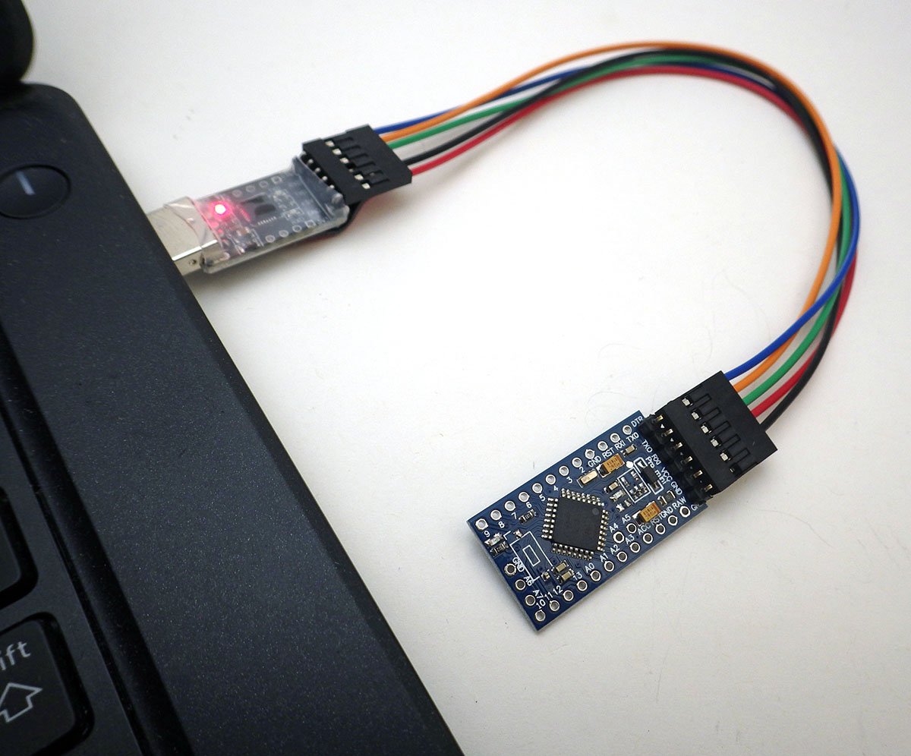 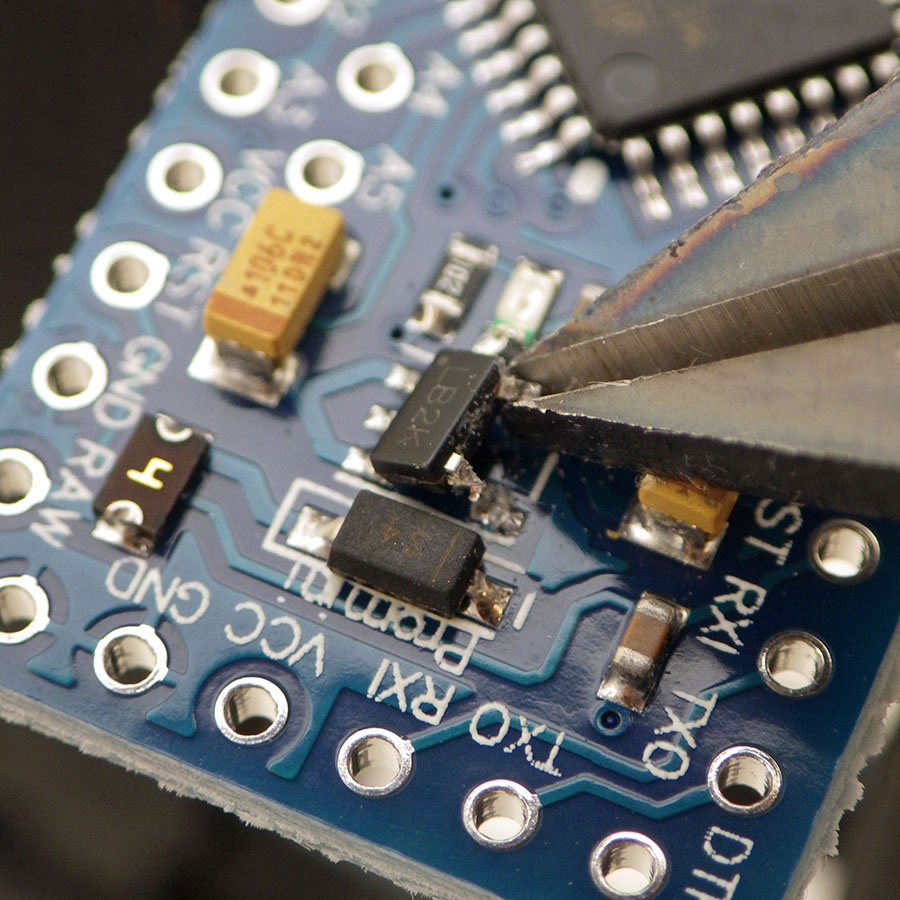 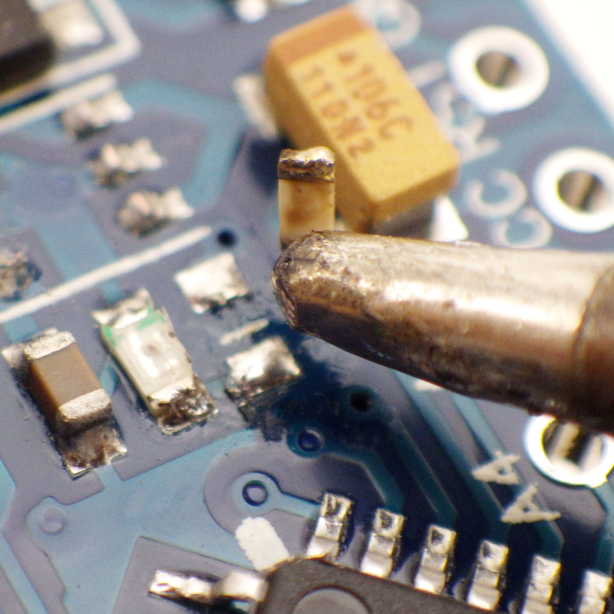

*L→R: blink test before any mods · clip the regulator (2-leg side) · lift the power-LED
limit resistor. Header detail:
[trimming the UART pin tails](images/steps/prom_headerpins_640pixw.jpg).*

### Add the indicator LED, thermistor & LDR

Following the Cave Pearl tutorial, these are soldered onto the Pro Mini **now, during prep,
before the two modules are joined**. All are **required** for this build: every profile in
this guide (BURN-IN, DEPLOY) drives the RGB LED and logs the NTC channel, and
the BURN-IN profile also logs the LDR for the Stage 4 soak test.

**RGB indicator LED** — the main sketch expects `LED_GndGB_A0_A2`: common-cathode RGB with
the **red leg cut off** (the onboard D13 LED — red on most boards, sometimes yellow/green/blue
on clones — plus its 1 kΩ resistor stay and serve as the red channel).

1. Cut the RGB LED's **red** leg at the body.
2. Solder: longest leg (common cathode) → **A0**, green → **A1**, blue → **A2**.
3. No series resistor needed — the code lights the channels through the 328p's internal
   pullups (~36 kΩ), keeping LED current under 50 µA.

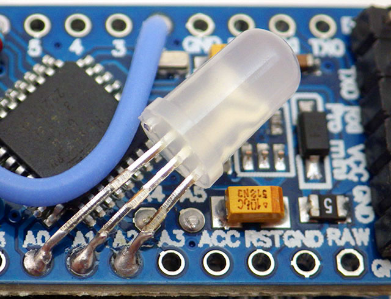

*RGB LED seated on A0–A2 with the red leg removed.*

**NTC / LDR burn-in circuit** — resistances are read by timing a capacitor's rise through
each component using the 328p's Input Capture Unit — no analog pins used
([method](https://thecavepearlproject.org/2019/03/25/using-arduinos-input-capture-unit-for-high-resolution-sensor-readings/)).
Solder, with each component's far ends joined at a common node with the 0.1 µF cap to GND:

| Pin | Component |
|-----|-----------|
| D6 | 10 kΩ 1% metal-film **reference** resistor |
| D7 | 10 kΩ NTC thermistor (β 3950) |
| D8 | 300 Ω resistor (the ICU timing pin) |
| D9 | LDR (GL5528) |
| GND | 0.1 µF (104) ceramic cap from the common node |

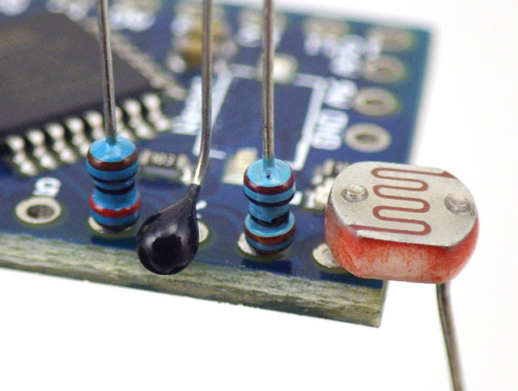 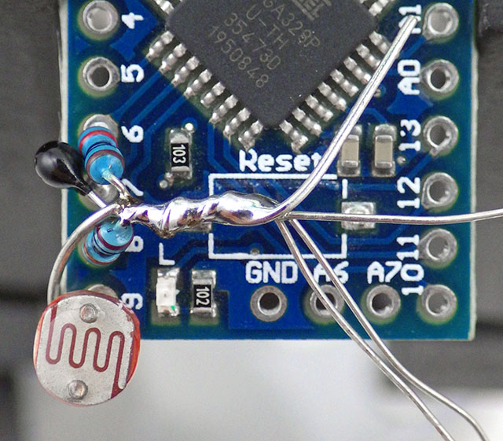 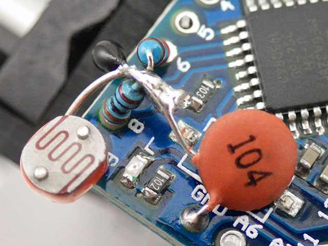 

*L→R: component layout on D6–D9 · far ends gathered into the common node · the 104 cap
completing the ICU timing circuit · the same node on the schematic (local copy).*

> **VERIFY (Stage 1):** re-run `tests/01_UploadBlink`. Heartbeat still prints at 500000
> baud and the **onboard D13 LED** still blinks (it's red on most boards, but often yellow,
> green or blue on clones, and may sit anywhere along the D9–D13 edge — the colour and
> position don't matter); the board now only powers up while the UART
> adapter is connected (expected). **If you fitted the RGB LED**, all three colours must
> rotate: D13 (the onboard LED, whatever its colour) → GREEN → BLUE, matching the serial
> monitor's announcements — a colour
> that never lights = wrong leg order, all dark = cathode not on A0. **If you fitted the
> NTC/LDR circuit**, there is no dedicated test sketch — it is exercised by the burn-in run
> in Stage 4; for now confirm visually that all five components share one node, the cap
> goes to GND, and there are no bridges between D6–D9. (Once burn-in starts, sane values
> are: NTC ≈ 10000 Ω at ~25 °C, dropping when warmed with a finger; LDR swinging hugely
> between room light and darkness.)

---

## Stage 2 — RTC module preparation

The DS3231 module is modified to run permanently from the coin cell ("backup" input):

1. **Remove the 200 Ω charging resistor** — it would try to charge the non-rechargeable
   CR2032 (the cell tolerates small reverse currents, but the charge circuit also leaks).
2. **Remove the power-LED limit resistor.**
3. **Lift/cut the module's main VCC leg** (2nd pin from the corner on the header) so the
   DS3231 runs from the battery input only.
4. **Bridge VCC to the coin-cell side** at the black-ring end of the module's diode, so
   the logger rail and RTC share the cell.
5. **Clip the 32 kHz header pin** — that output is non-functional when running from Vbat.
6. **[OPTIONAL]** conformal-coat the module (avoiding the battery clip and header) after
   it passes Stage 3 testing.

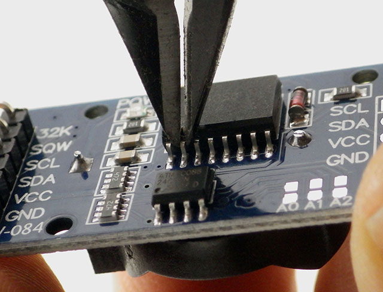 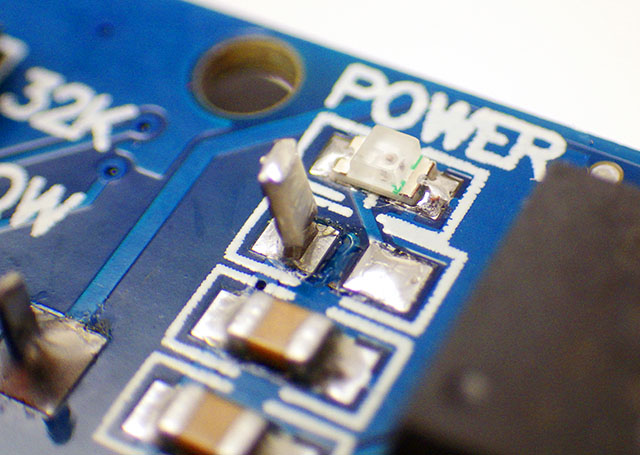 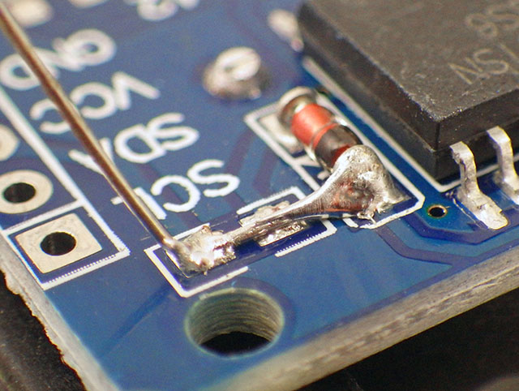 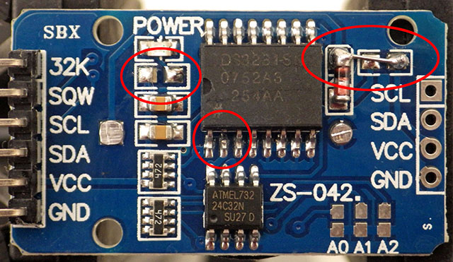

*L→R: clip the VCC leg · disconnect the power LED · bridge VCC to the coin-cell side at
the diode's black ring · all mods done (use this last photo as your visual-QC reference).*

> **VERIFY (Stage 2):** visual only — four removals confirmed under magnification, no
> solder bridges, battery clip spring intact. Electrical verification comes at Stage 3.

---

## Stage 3 — Joining the two modules

1. Stick double-sided foam tape across the RTC module's chips; press the Pro Mini
   (component side out) onto it, programming header away from the battery holder.
2. Extend **A4 → SDA** and **A5 → SCL** with resistor-leg offcuts in heat-shrink.
   **These two must cross over each other** to land on the right RTC pads — straight-through
   is the single most common Stage 3 mistake.
3. Extend **VCC** and **GND** rails between the boards the same way.
4. Thread the jumpers through the RTC module's pass-through port, press, solder all four.
5. Solder the alarm line: **RTC SQW → Pro Mini D2** (resistor leg or 26 AWG). If you fitted
   the indicator LED in Stage 1, use a longer length of flexible wire here so the jumper
   doesn't cover the D13 LED (per the tutorial).
6. Insert a CR2032.

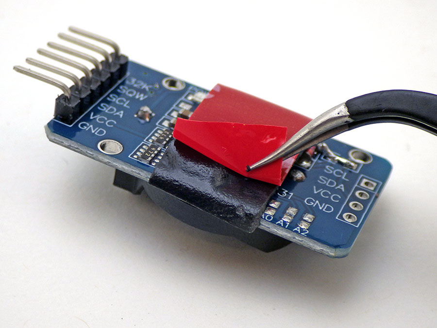 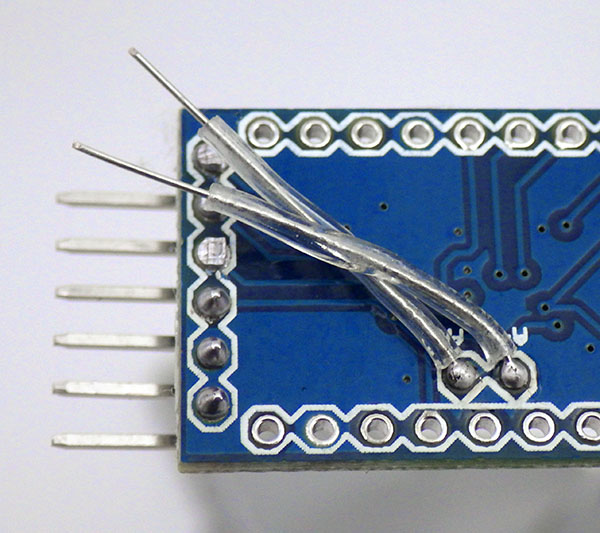 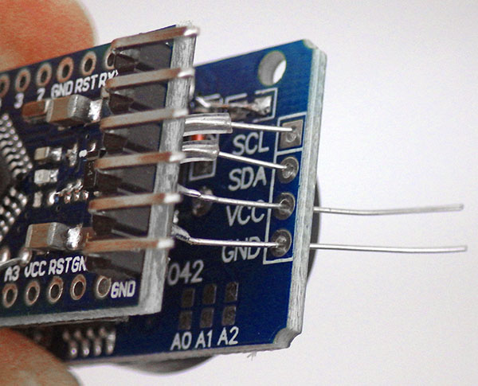 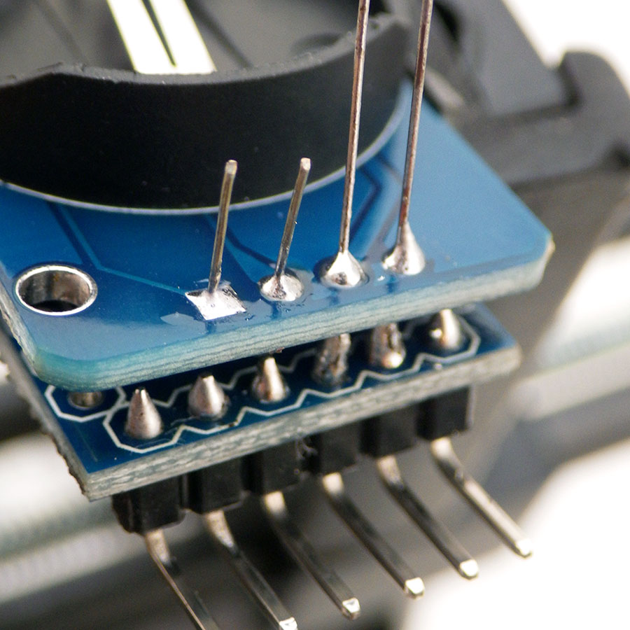

*L→R: foam tape across the RTC chips · the A4/A5 **crossover** in heat-shrink · threading
through the pass-through port · soldering the four joints.*

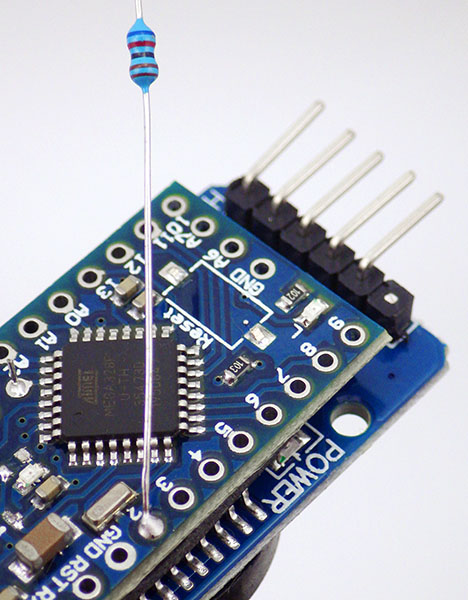 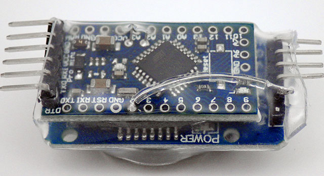

*The alarm line: 32 kHz pin already trimmed, then the heat-shrinked SQW → D2 jumper.*

> **VERIFY (Stage 3):** with UART connected, run in order:
> 1. `tests/02_I2C_Scanner` → `CORE CHECK: PASS` (0x68 + 0x57 both found).
>    FAIL → re-flow the four joints; check the A4/A5 crossover.
> 2. `tests/03_RTC_Test` → send `T` once to set the clock, then all four summary lines
>    PASS. `D2 Alarm: FAIL` → re-flow the SQW→D2 jumper.
> 3. `tests/04_EEprom_Test` → type `Y` → `ALL EEPROM TESTS: PASS` (tests the 4k now; it
>    also tests an external EEprom at 0x50 later if you fit one).
> Then pull the UART adapter and confirm the RTC keeps time on the coin cell alone:
> reconnect after a minute and re-run `03_RTC_Test` — OSF must still read PASS.

---

## Stage 4 — Calibration, main sketch & burn-in run

Per unit, UART connected:

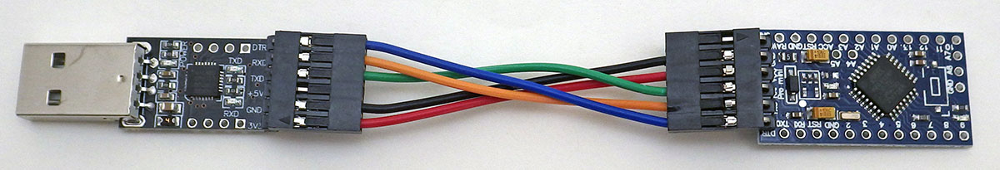 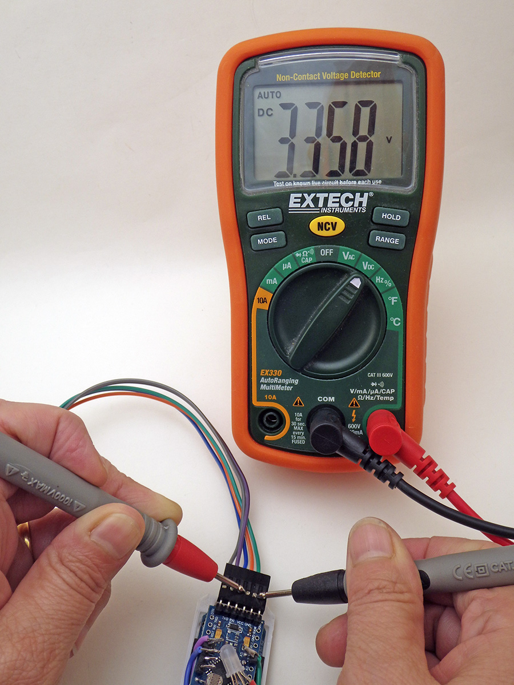

*UART hookup for all Stage 4 work, and the VCC/GND contact points to probe while
calibrating the voltage reference.*

1. **Calibrate the voltage reference:** run `tests/05_VccCal`, measure VCC↔GND with your
   multimeter, type the millivolts (e.g. `3302`), and **record the printed constant on the
   unit's checklist**. Each 328p's internal bandgap is different; uncalibrated readings
   can be off by >100 mV, which corrupts the low-battery shutdown logic.
2. **Measure sleep current:** run `tests/06_SleepCurrent`, follow its banner (unplug UART,
   meter in µA range in series with the coin cell). **Target ≤ 2 µA**; >100 µA = clone
   chip or regulator remnant — reject or rework the unit. Record the value.
3. **Flash the main sketch** (`2-Part_ProMiniFalconTubeLogger`) with the **BURN-IN
   profile** defines from the top of this document.
4. Open the serial monitor at 500000 baud. In the start menu:
   - `[2]` set the RTC clock (this also clears any power-loss flag)
   - `[99]` → `[10]` enter the calibration constant from step 1
   - `[3]` set a 15-minute interval (or 1 minute for a quick shakedown)
   - `[6]` START logging — the LED pips confirm sampling has begun
   - the menu times out after 8 minutes of inactivity; reconnect to restart it
5. Disconnect UART, note the start time on the checklist, and leave the unit running on
   coin cell for **24–72 h**.
6. **Download & inspect:** reconnect UART (the running logger restarts into its menu),
   choose `[1]` DOWNLOAD, and copy the CSV from the monitor (PuTTY/CoolTerm/Termite handle
   big transfers more gracefully). A healthy unit shows:
   - no missed intervals (timestamps evenly spaced),
   - battery (LowestBattery) flat or gently declining — a new CR2032 sags under load by
     only tens of mV; a steep slope or >100 mV random jumps = weak cell or bad battery
     contact (hot-glue the cell in place),
   - RTC temperature tracking the room, NTC ohms moving inversely to temperature, LDR
     tracking day/night.

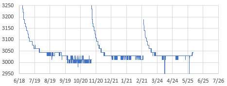 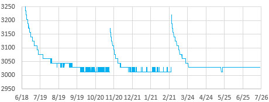

*What a healthy battery curve looks like over a full deployment (tutorial's 11–12 month
runs with BMP280 and BH1750) — your 24–72 h burn-in should sit on the flat left end of
curves like these.*

> **VERIFY (Stage 4):** checklist gets: calibration constant, sleep current µA, burn-in
> start/end, "download clean Y/N". Any unit with gaps, resets, or battery sag fails QC.

---

## Stage 5 — Deployment sensors & final QC

### Wiring the shared I2C bus (both sensors + the 64k EEprom)

I2C is a **shared bus**: every device hangs off the *same* four wires — VCC, GND, SDA, SCL.
You do **not** run a separate cable back to the Pro Mini for each module. You extend the one
bus and tap each module onto it in parallel. That bus originates at the Pro Mini's **A4 (SDA)**
and **A5 (SCL)** plus the **3.3 V** and **GND** rails — the same lines that, after Stage 3,
already run across to the RTC module (which carries the DS3231 at 0x68 and the on-board 4k
EEprom at 0x57). The two sensors — and the external 64k EEprom from
[Appendix B](#appendix-b--add-an-external-i2c-eeprom-for-more-storage), which the DEPLOY
profile logs to — all join that same bus.

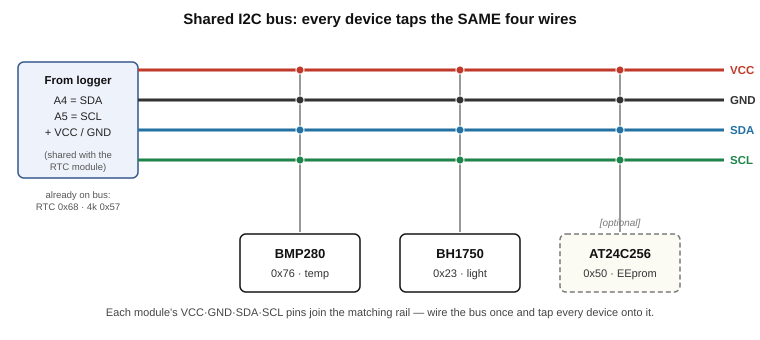

**Every device gets the same four connections** (only the address differs):

| Wire | Goes to | Rail it joins |
|------|---------|---------------|
| VCC | module VCC / 3V3 / VIN | 3.3 V rail (never 5 V) |
| GND | module GND | GND rail |
| SDA | module SDA | A4 line |
| SCL | module SCL | A5 line |

**Addresses already on the bus (all distinct — nothing collides):**

| Address | Device |
|---------|--------|
| 0x23 | BH1750 light sensor |
| 0x50 | external 64k EEprom — DEPLOY storage *(Appendix B)* |
| 0x57 | 4k EEprom on the RTC module |
| 0x68 | DS3231 RTC |
| 0x76 | BMP280 |

**How to join them physically:**

- **Daisy-chain (recommended for these 2–3 modules):** carry all four wires from the bus to
  the first module, then from that module's pins on to the next, and so on. Short F-F Dupont
  leads or solid-core resistor-leg offcuts both work; remember the SDA/SCL **crossover** still
  applies on the leads coming off the logger (A4→SDA, A5→SCL).
- Keep the whole bus short (a few cm of total wiring). Long stubs degrade the signal and make
  the scanner miss devices.
- **Pull-ups:** SDA and SCL need pull-up resistors to VCC. The `Wire` library already enables
  the 328p's internal ~30–50 kΩ pull-ups, and most cheap breakout modules carry their own
  4.7–10 kΩ pull-ups. For this short 2–3 device bus that is fine — **do not** add extra
  pull-ups (too many in parallel overloads the bus). Stacking many modules is the one case
  where you'd remove the on-board pull-ups from all but one.

1. Wire the **BMP280** and **BH1750** (and the external EEprom, if you're fitting one) onto
   the shared I2C bus as shown above — same VCC/GND/SDA/SCL on every module, 3.3 V only.
2. Run `tests/02_I2C_Scanner` → it should list every device on the bus: `0x23`, `0x68`,
   `0x76` (and `0x50` if the EEprom is fitted), with sensor lines showing `BMP280 found,
   BH1750 found`. A missing address means that module's joint or address is the problem.
3. Run `tests/07_SensorTest` → both sensors report; finger on the BMP280 raises the
   temperature, covering the BH1750 drops lux toward 0. Plausible-but-frozen values mean
   a dead sensor on a good bus.
4. **Re-flash the main sketch with the DEPLOY profile** (LDR define now commented out).
5. Repeat the start-menu sequence from Stage 4 step 4 (clock, constant, interval, START).
   The startup screen must show 8 bytes/record and list: Battery, RTC °C, NTC, BH1750 lux,
   BMP temp. A `not PowerOfTwo → MUST CHANGE CONFIG!` shutdown means the defines don't
   match the profile — fix and re-flash.
6. **[OPTIONAL, but see the warning below]** add the rail buffer capacitor (220–1000 µF
   tantalum across VCC/GND,
   [placement photo](images/steps/2023_indicator-on1000ufcap_900pixw.jpg))
   if a unit shows voltage-sag resets in burn-in data; costs only ~15–25 nA of leakage.

   > **Diagnostic signature of missing rail cap:** if `LoBat[mv]` and `RTC[°C]` both look
   > perfectly healthy but `[°C]bmE` is stuck at a constant `-0.01` (or another fixed,
   > wrong value) on **every** record, and/or the NTC's `D7[Ω]` reads implausibly small
   > (single/low-double digits instead of ~10 kΩ) — while the *exact same unit* reads both
   > sensors correctly when tethered to UART power — that's not a dead sensor. It's the
   > coin cell's poor transient current delivery sagging the rail for the few milliseconds
   > of the BME280 I2C burst / NTC Timer1 capture, which the averaged `LowBat` reading never
   > catches. UART power (from the USB-serial adapter's regulator) doesn't sag the same way,
   > which is why the fault only shows up running on the coin cell. Add the rail cap.
7. Hot-glue the coin cell against its spring contact, run a final short logging interval
   (1-minute interval for an hour), download, and sign off the checklist.

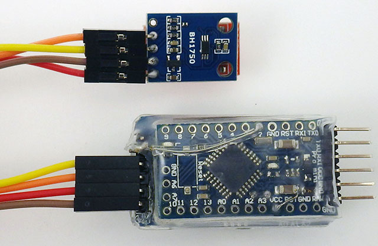 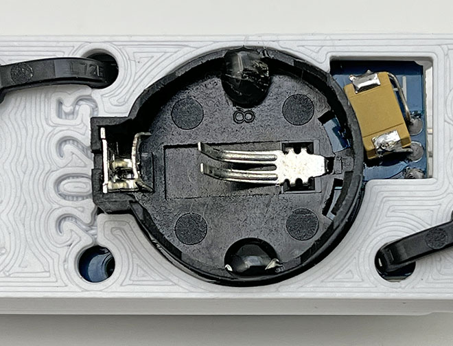 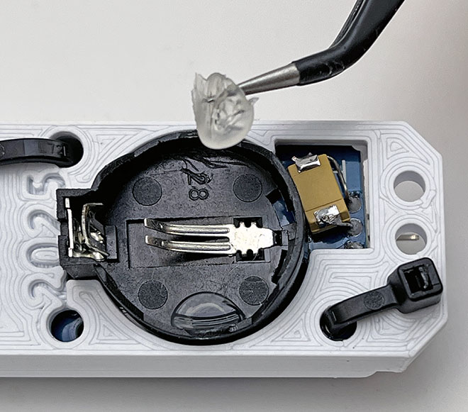

*L→R: F-F Dupont leads carrying the I2C bus out to a sensor (remember SDA/SCL crossover) ·
hot-glue drops in the holder · the glue conformed around the seated cell.*

> **VERIFY (Stage 5):** checklist gets: both sensor addresses seen, sensor wiggle test
> PASS, DEPLOY profile flashed, final 1-h shakedown clean. Unit is ready to deploy.

---

## Troubleshooting

| Symptom | Likely cause → fix |
|---|---|
| Garbled serial monitor text | Wrong baud — set **500000** in the monitor's dropdown and reopen it |
| Upload fails / no bootloader | Wrong board setting (must be 3.3 V/8 MHz), TX/RX swapped, or dead clone — reject |
| `02_I2C_Scanner`: no devices | VCC/GND joints between modules; UART adapter set to 5 V instead of 3.3 V |
| Scanner finds 0x68 but not 0x57 | EEprom corner pads of RTC module bridged/cold joint |
| `03_RTC_Test` D2 Alarm FAIL | SQW→D2 jumper cold joint, or wrong RTC pad used |
| OSF flag keeps returning / date shows `*2000*` | Coin cell not making contact (hot-glue it), VCC-to-Vbat bridge missed in Stage 2 |
| Sleep current 50–100 µA | Regulator not fully removed — clip remaining legs |
| Sleep current >100 µA | Clone/fake 328p (won't sleep below ~100 µA) — reject board |
| Sleep current 3–10 µA | Flux residue (clean with isopropyl), meter burden voltage, optional cap leakage |
| `not PowerOfTwo → MUST CHANGE CONFIG!` at startup | Enabled `#define`s don't sum to 1/2/4/8/16 bytes — use a profile from this guide verbatim |
| Logger starts then dies randomly on battery | Weak coin-cell spring contact; cell below ~2850 mV under load |
| Readings stop partway through a deployment | EEprom full — normal (512 records on the RTC 4k for BURN-IN, 8192 on the DEPLOY 64k chip — [Appendix B](#appendix-b--add-an-external-i2c-eeprom-for-more-storage)); lengthen the interval for longer runs |

---

## Appendix A — the powers-of-2 rule

Every enabled sensor `#define` adds bytes to each record (the count is printed at
startup). The total **must be 1, 2, 4, 8 or 16** because records must align with the
EEprom's internal 32-byte page boundaries — a 6-byte record would eventually straddle a
page edge, and the chip wraps around *within* the page instead of advancing, silently
corrupting data. The sketch checks this at startup and shuts down rather than log garbage.
That is why both profiles above pad or trim to exactly 8 bytes.

| This build's byte costs | Bytes |
|---|---|
| `logLowestBattery_1byte` | 1 |
| `logRTC_Temperature_1byte` | 1 |
| `logCurrentBattery_2byte` (padding) | 2 |
| `readD7resistorwD6ref_2byte` (NTC) | 2 |
| `readD9resistorwD6ref_2byte` (LDR) | 2 |
| `readBh1750_LUX_2byte` | 2 |
| `recordBMEtemp_2byteInt` (BMP280) | 2 |

## Appendix B — add an external I2C EEprom for more storage

The 4k EEprom on the RTC module holds only **512 records** at 8 bytes each (~5.3 days at
15 min). The tutorial shows how to add a larger AT24-series I2C EEprom to extend that — the
logger code already supports it, so this is mostly a wiring + two-`#define` change. **The
DEPLOY profile logs to a 64k AT24C512 at 0x50, so every deployment unit gets this chip in
Stage 5**; only the BURN-IN shakedown still runs on the RTC module's 4k.

### Capacity you gain

| Chip | Storage | I2C addr | Records @ 8 B | ~Days @ 15 min |
|------|---------|----------|--------------:|---------------:|
| AT24C32 (default, on RTC module) | 4096 B | 0x57 | 512 | 5.3 |
| AT24C256 (32k module) | 32768 B | 0x50 | 4096 | 42 |
| AT24C512 (64k chip) | 65536 B | 0x50 | 8192 | 85 |

64k (65536 B) is the largest a single chip can use here — the code addresses the EEprom
with a 16-bit pointer, which tops out at 65535.

### Two ways to add it

> Tutorial quote: *"With a practiced hand you can add more EEprom memory right onto the
> RTC module."* For a deadline build, the breakout-module route (Method 1) is far lower
> risk than soldering a bare SOIC chip.

**Method 1 — separate EEprom breakout module (recommended).** A ~$1 AT24C256 module
wires to the same four I2C lines you already use for the sensors:

| Module pin | Logger |
|------------|--------|
| VCC | 3.3 V rail |
| GND | GND |
| SDA | A4 side of the bus |
| SCL | A5 side of the bus |
| A0 / A1 / A2 | all left **low/unconnected → address 0x50** |

Chain it onto the existing sensor bus exactly as described in
[Stage 5 → Wiring the shared I2C bus](#wiring-the-shared-i2c-bus-both-sensors--the-64k-eeprom)
(don't run separate leads back to the Pro Mini) — it just adds one more device, at 0x50.

**Method 2 — chip stacked on the RTC module (advanced).** An AT24C512 soldered piggyback
on top of the module's existing AT24C32. Tutorial: *"you only need connect the four pins
shown because the chip internally grounds any pin left floating."* The module already pulls
its own chip's address pins high (that is why the 4k sits at **0x57**); a stacked chip with
its address pins left floating lands at **0x50**, so the two never collide.

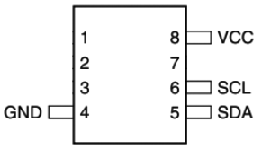 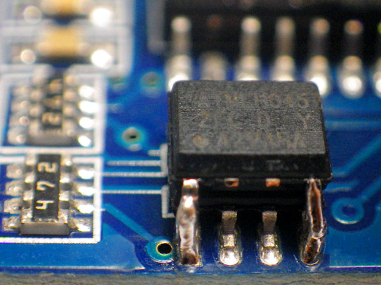

*Left: the AT24C512 connection schematic (only four pins needed). Right: a 64k chip stacked
on the RTC module — the added chip answers at 0x50 while the original 4k stays at 0x57.*

### Configure the sketch

The DEPLOY sketch (`2-Part_Logger_DEPLOY`) already ships with these set for the 64k
AT24C512. If you fit a different chip size, change **both** copies of the defines — the
STEP0 block (around line 108) **and** the duplicate ~40 lines below (around line 146). Both
must agree or the runtime capacity math is wrong:

```cpp
// 64k AT24C512 (as shipped in the DEPLOY sketch):
#define EEpromI2Caddr 0x50
#define totalBytesOfStorage 65536
// 32k AT24C256 module:  use 0x50 and 32768
```

That is all the code needs — it keys its I2C bus speed and EEprom write-recovery timing off
`totalBytesOfStorage` automatically (the old 4k chip is held to 100 kHz; larger chips run
the bus at 400 kHz and get an extra IDLE recovery period between page writes). The
powers-of-2 record rule from [Appendix A](#appendix-a--the-powers-of-2-rule) is unchanged —
1/2/4/8/16 bytes divides evenly into both the 4k chip's 32-byte page and the larger chips'
64-byte page.

### Verify before trusting it

1. Set `EXTERNAL_BYTES` near the top of `tests/04_EEprom_Test` to your chip size (`32768UL`
   for a 32k AT24C256, `65536UL` for a 64k AT24C512), then run it. The test auto-detects the
   chip at 0x50, tests it alongside the 4k, and prints `ALL EEPROM TESTS: PASS` across every
   byte. This is the real proof the chip and every joint are good.
2. Run `tests/02_I2C_Scanner` → the summary line `EXTERNAL EEprom (0x50): found` confirms it
   is on the bus alongside 0x57 and 0x68.
3. Flash the main sketch with the **DEPLOY profile** (see [Build configuration](#build-configuration-used-in-this-guide));
   the startup `RUNtime:` line should now report the larger byte total and a much longer run
   estimate.

### Cautions

- **Sleep current:** each added EEprom adds only ~0.2–0.4 µA — negligible against the 2 µA
  budget, but record it on the checklist if you re-run `06_SleepCurrent`.
- **Whole-page writes:** AT-series chips erase and rewrite an entire page on every write
  regardless of byte count — another reason the powers-of-2 alignment matters.
- **One address per chip:** two added chips both default to 0x50 and will collide; the
  tutorial's multi-chip stacks set different address pins (e.g. 0x50 and 0x51). This guide
  covers a single added chip only.

## Appendix C — [OPTIONAL] falcon-tube housing

The repo root contains `2PartProMiniLoggerRail.stl` (logger carrier rail) and
`2PartLoggerr_30mlMountingBracket_v9.stl` (tube mounting bracket) for a 50 ml falcon-tube
deployment housing. Print, slide the finished logger onto the rail, desiccant pack in the
tube cap, and see the tutorial video for the o-ring details. Not part of batch bench QC.

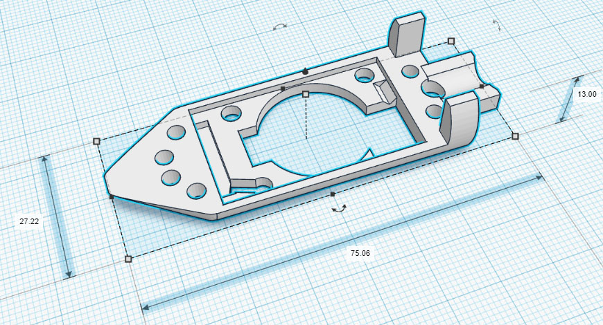 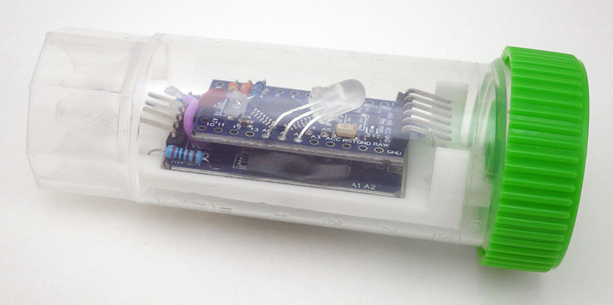

*The printed rail system and a completed logger in its tube with desiccant packs.*

---

## Appendix D — device operation (how the finished logger works)

This section describes the logger's normal behaviour once built, independent of the build
stages above.

**Power and autonomy.** The logger runs entirely from a single CR2032 coin cell — the Pro
Mini's regulator is removed and the DS3231 RTC shares the same cell through its Vbat input.
With sleep current held at ≤ 2 µA a unit lasts roughly a year on one cell (sensor- and
interval-dependent). There is no power switch: the board is dormant unless the RTC alarm
wakes it or the UART adapter is plugged in.

**The sample-sleep cycle.** Almost all the time the ATmega328P is in deep sleep
(`LowPower.powerDown`, microamp range). The DS3231 keeps time independently and pulls its
SQW line low at each scheduled alarm; that edge reaches D2 (interrupt 0) and wakes the
processor. The logger reads the enabled sensors, appends one record to the EEprom, arms the
next alarm, and powers back down. The indicator LED pips briefly on each sample, so a blink
once per interval is the visible "still alive" sign.

**Sampling interval.** Set through the menu; allowed values are 1, 2, 3, 5, 10, 15, 20 or
30 minutes (each must divide evenly into 60). A reading must finish within its interval, so
very short intervals leave little margin — overrun an alarm and the logger waits for the
next one.

**Storage and run length.** Records are written to the external 64k EEprom
([Appendix B](#appendix-b--add-an-external-i2c-eeprom-for-more-storage)) — 8192 records of
8 bytes. When it fills, logging simply stops; the firmware does not wrap or overwrite, so
the earliest data is always safe. Run length = 8192 × interval (≈ 85 days at 15 min,
≈ 5.7 days at 1 min). For longer deployments lengthen the interval.

**Starting a run.** The logger is only ever started through the serial menu at
500000 baud. The sequence is `[2]` set the RTC clock → `[10]`
enter this unit's VREF calibration constant → `[3]` set the interval → `[6]` START. The LED
pips confirm logging has begun; disconnect the UART and it runs on its own. If the menu
times out (see Stage 4), just reconnect to bring it back.

**Start-menu reference** (500000 baud):

| Key | Action | Key | Action |
|-----|--------|-----|--------|
| `[1]` | DOWNLOAD data | `[5]` | serial echo on/off |
| `[2]` | set RTC clock | `[6]` | START logging |
| `[3]` | set interval | `[10]` | set VREF constant |
| `[4]` | deployment info | `[11]` | RTC aging offset |
| `[13]` | shutdown | `[12]` | dump raw EEprom bytes |

**Retrieving data.** Reconnect the UART and the logger drops into its menu; `[1]` DOWNLOAD
streams the dataset as timestamped CSV (read-only and repeatable). Capture it with a
terminal such as PuTTY, CoolTerm or Termite. Starting a *new* run erases the EEprom, so
always download first. (Full procedure in Stage 4 step 6.)

**Battery and data protection.** Lowest battery voltage is logged with every record. The
firmware shuts the logger down at **~2795 mV** — just above the 2775 mV brown-out / EEprom
write limit — to avoid corrupting memory on a dying cell. After any power loss, a startup
handshake plus the RTC oscillator-stop flag prevent existing data from being overwritten by
an accidental restart. The classic field failure is a weak cell or poor spring contact,
which shows up as the D13 LED flashing rapidly in a brown-out restart loop — re-seat and
hot-glue the cell.

**Connecting to a live logger.** Plugging in the UART interrupts the run and returns to the
menu, so don't connect to a deployed unit unless you intend to download or restart it.
